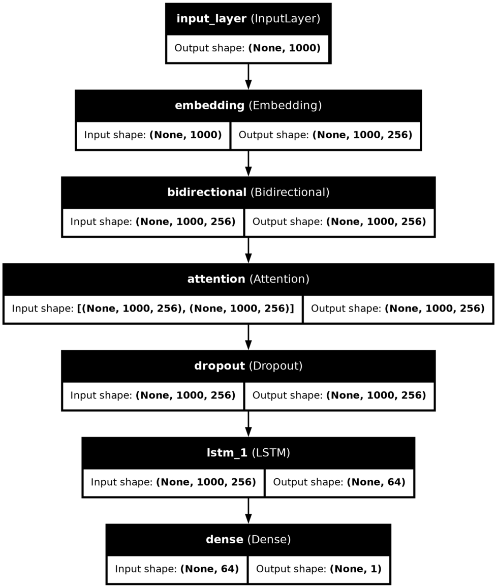

# Automated Essay Scoring 2.0 with KerasNLP & LSTM

Enhancing automated essay scoring with advanced AI techniques using Keras-NLP and LSTM, aimed at improving educational outcomes through accurate assessment of student essays.

    

## Overview

Welcome to our project on Automated Essay Scoring 2.0 using KerasNLP and Keras. Our goal is to develop an AI model capable of scoring student essays, improving upon existing algorithms to enhance educational outcomes.

## Workflow

### Data Preprocessing

We begin by loading and preprocessing text data from CSV files containing student essays. This includes tokenization using Keras' Tokenizer and padding sequences to a maximum length for model input.

### Model Architecture

Our model architecture utilizes a Bidirectional LSTM with attention mechanisms. This design helps capture both past and future context of words in the essays, enhancing the model's understanding of the text.

### GPU Setup

To expedite training, we configure TensorFlow to utilize available GPUs. This setup is crucial for handling the computational demands of training large-scale natural language models efficiently.

### Training and Evaluation

The model is trained using TensorFlow's MirroredStrategy for GPU utilization. We employ techniques such as early stopping and learning rate reduction to optimize training and prevent overfitting.

### Model Evaluation

After training, we evaluate the model's performance using validation data. Metrics such as Mean Squared Error (MSE) are used to assess how well the model predicts essay scores.

## Model Architecture

    

The above diagram illustrates the architecture of our essay scoring model. It shows the flow of data through various layers including embedding, bidirectional LSTM, attention, and dense layers for final scoring.

## Results and Contributions

Our approach aims to significantly enhance the accuracy of automated essay scoring systems, thereby providing valuable insights into student performance. We welcome contributions and feedback to improve our model and methodology further.

## References

- [Kaggle Competition](https://www.kaggle.com/competitions/learning-agency-lab-automated-essay-scoring-2)
